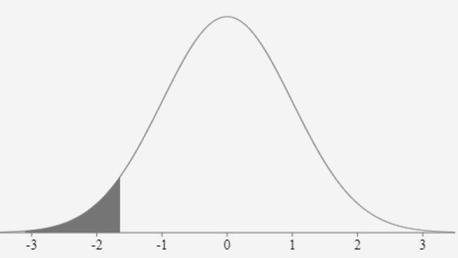

```{css, echo = FALSE}
ul li {
    font-size: 16px;
}

pre {
  font-size: 12px;
  line-height: 1.2em;
}

.valjund {
  font-size: 12pt;
}

p.caption {
  font-size: 0.5em;
  font-style: italic;
}
```

```{r setup, include=FALSE}
knitr::opts_chunk$set(echo = TRUE,
                      fig.width = 6, fig.height = 4)
if (dir.exists("C:/Users/Public/Rstudio_packages")) {
  .libPaths("C:/Users/Public/Rstudio_packages")
}
```

# Hüpoteeside testimise mõte

## Võtame ühe näite

:::: {style="display: flex;"}
:::{}
- Kas usaldus Riigikogu vastu on sisserändajate ja Eestis sündinute võrdluses keskmiselt erinev?
  - Teisiti sõnastades: kas sisserändajad ja Eestis sündinud usaldavad Riigikogu keskmiselt erineval määral?
  - Analüüsime seda ESS 2018. aasta andmete alusel

```{r message = FALSE}
library(haven)
library(tidyverse)
library(TAM)

ee9 <- read_spss("data/ee9.sav")

ee9 <- ee9 %>% 
  mutate(brncntr2 = recode(as.factor(brncntr), 
                           "1" = "Jah",
                           "2" = "Ei"))

ee9 %>% 
  group_by(brncntr2) %>% 
  summarise(keskmine = weighted_mean(trstprl, w = pspwght))
```
:::
:::{}
- Näeme, et keskmised erinevad 0,4 palli võrra, mis pole just suur erinevus, aga võib siiski sisulisel tasandil oluline olla
- See erinevus käib selle valimi kohta, kas saame keskmiste erinevust väita ka populatsioonis (rahvastikus)?
:::
::::
  
## Arvutame keskmiste usaldusvahemikud
  
- Arvutame keskmiste usaldusvahemikud usaldusnivool 95% (vaikeseadena seadistatud, ei pea koodis eraldi välja kirjutama)

```{r eval = FALSE}
library(survey)

ee9w <- svydesign(id = ~1, data = ee9, weights = ~pspwght)

svyby(~trstprl, ~brncntr2, design = ee9w, FUN = svymean, na.rm = TRUE, vartype = c("se", "ci")) %>% 
  ggplot(aes(x = brncntr2, y = trstprl)) +
  geom_point(stat = "identity") +
  geom_errorbar(aes(ymin = ci_l, ymax = ci_u), width = 0.1, color = "black") +
  xlab("Eestis sündinud") +
  ylab("Usaldus Riigikogu vastu")
```

## Arvutame keskmiste usaldusvahemikud

:::: {style="display: flex;"}
:::{}
```{r message = FALSE, echo = FALSE, fig.cap = "Joonis 1. Usaldus Riigikogu vastu (mõõdetud skaalal 0-10) Eestis sündinute ja sisserännanute seas: aritmeetilsed keskmised koos usaldusvahemikega usaldusnivool 95%. Andmed: Euroopa Sotsiaaluuring 2018."}
library(survey)

ee9w <- svydesign(id = ~1, data = ee9, weights = ~pspwght)

svyby(~trstprl, ~brncntr2, design = ee9w, FUN = svymean, na.rm = TRUE, vartype = c("se", "ci")) %>% 
  ggplot(aes(x = brncntr2, y = trstprl)) +
  geom_point(stat = "identity") +
  geom_errorbar(aes(ymin = ci_l, ymax = ci_u), width = 0.1, color = "black") +
  xlab("Eestis sündinud") +
  ylab("Usaldus Riigikogu vastu")
```
:::
:::{}
- Usaldusnivool 95% saame öelda, et
  - Eestis sündinud inimeste seas on parlamendi usaldamise tegelik keskmine vahemikus 4,71 kuni 4,96 palli
  - mujal riigis sündinute seas on tegelik keskmine vahemikus 4,9 kuni 5,58 palli
- Usaldusnivool 95% usaldusvahemikud kattuvad, kuigi vähesel määral
- Keskmiste usaldusvahemike võrdlemise põhjal keskmiste erinevust väita ei saa
- Kui usaldusvahemikud mingil määral kattuvad, siis keskmiste erinevuse osas saaks täpsema järelduse statistilise testi põhjal, mis testib keskmiste erinevust
- Teeme läbi hüpoteeside testimise *t*-testi põhjal
:::
::::

## Hüpoteeside testimine

- Statistiline hüpotees
   - oletus üldkogumi (nt selle jaotuse või parameetri) kohta,
   - mida testitakse valimiandmete alusel
- Kontrollime / testime hüpoteesi, et Eestis sündinute ja sisserännanute usaldus Riigikogu vastu keskmiselt erineb
- Milles on hüpoteeside testimise iva?
  - Meil on olemas ainult valimiandmed, valimis näeme, et Eestis sündinute ja sisserännanute usaldus parlamendi vastu on keskmiselt mõnevõrra erinev
  - Kas me saame öelda, et keskmiste erinevus esineb ka populatsioonis?
  - Me ei tea seda, sest valim ei pruugi olla täiesti täpne koopia populatsioonist
  - Eeldusel, et meie valim on tõenäosuslik (st juhuvalim), saame hinnata, kas võib väita keskmiste erinevust ka populatsioonis
- Selleks peame esmalt sõnastama alternatiivhüpoteesi ja nullhüpoteesi

# Hüpoteeside testimise loogika

## Hüpoteeside sõnastamine

- Alternatiivhüpotees (H1) – reeglina sõnastatud nii, et väidab erinevuse esinemist / seose
  kehtimist
- Nullhüpotees (H0) – vastupidine sellele
- Praegusel juhul:
  - H0: Eestis sündinute ja sisserännanute keskmine usaldus Riigikogu vastu ei erine ($m_e = m_s$)
  - H1: Eestis sündinute ja sisserännanute keskmine usaldus Riigikogu vastu erineb ($m_e \neq m_s$)
- Oluline: hüpoteesipaari hüpoteesid peavad 
  - teineteist välistama
    - ei saa olla H0: $m_e \geq m_s$ ja H1: $m_e \leq m_s$
  - katma kõikvõimalikud olukorrad
    - ei saa olla H0: $m_e = m_s$ ja H1: $m_e \leq m_s$
- NB! Hüpoteesides ei pruugi olla öeldud, et need käivad populatsiooni kohta, aga meeles tuleb
  pidada, et tegu on statistiliste hüpoteesidega

## Esimest ja teist liiki viga
- Hüpoteesipaari testitakse statistilise testiga valimiandmete alusel
- Kaks võimalikku otsust: kas
    - võtame vastu alternatiivhüpoteesi või
    - jääme nullhüpoteesi juurde
- Tuletame meelde usaldusvahemiku teemat: 
  - aritmeetilise keskmise usaldusvahemiku arvutasime *valimiandmete alusel* ja püüdsime selle varal midagi öelda *populatsiooni kohta*
- Nii ka hüpoteeside testimisel püüame *valimi alusel hinnata*, kas/kuivõrd tõepärane on väita keskmiste erinevust *populatsioonis*
- Juhuvalim võib juhuslikkuse tõttu mõnevõrra populatsioonist erineda
- Seetõttu eksisteerib võimalus, et teeme valimi alusel populatsiooni kohta eksliku otsuse
- Esimest liiki viga – populatsioonis kehtib H0 (erinevust ei esine), aga jõuame valimiandmete
  põhjal järeldusele, et kehtib H1 (keskmised erinevad)
- Kuigi juhuvalik võimaldab saada valimi, mis on populatsioonile võimalikult sarnane, võib ikkagi mõningatel juhtudel valim juhuse tõttu populatsioonist niivõrd palju erineda, et jõuame eksliku järelduseni
    - Millisel juhul teeksime 1. liiki vea oma hüpoteesipaari puhul?
- Teist liiki viga – populatsioonis kehtib H1 (erinevus esineb), aga jõuame valimiandmete põhjal
  järeldusele, et kehtib H0 (erinevust ei esine)
    - Millisel juhul teeksime 2. liiki vea oma hüpoteesipaari puhul?

## Esimest ja teist liiki viga
- {width=95%}
- Hüpoteeside testimise loogika: me ei tea, kas populatsioonis kehtib H0 või H1
- Püüame jõuda tõele jälile, keskendudes mitte sellele, kas kehtib H1, vaid sellele, kas kehtib H0
- Kui valimiandmete põhjal leiame, et H0 kehtivus ei ole tõepärane, saame kinnitada H1, sest H0 ja H1 välistavad teineteise
- Seejuures prioriteet on vältida esimest liiki viga (ka teist liiki viga oleks halb, aga esimest liiki vea vältimine olulisem)
  - Reeglina väidetakse nullhüpoteesiga võrdumist või seose puudumist, alternatiivhüpoteesiga erinevust, seose esinemist
  - Seega prioriteet on vältida olukorda, kus väidame millegi (erinevuse, seose) esinemist, kui seda tegelikult ei eksisteeri
  - Ehk kinnitame H1 ainult juhul, kui tõendusmaterjal on kaalukalt nullhüpoteesi paikapidavuse vastu
  - Lähemalt on seda loogikat kirjeldanud nt [Tooding (2015: 143-144)](https://dspace.ut.ee/handle/10062/58548) ja [Navarro (2018: ptk 11.1)](https://bookdown.org/ekothe/navarro26/hypothesistesting.html)

# t-test

## Hakkame testima – millega?
- Niisiis, hüpoteesipaari testitakse valimiandmete alusel, otsus tehakse populatsiooni kohta
- Keskmised ja nende erinevuse arvutame valimi alusel, aga kuidas nende alusel hinnata, kas saame keskmiste erinevust väita populatsiooni kohta?
- Selleks ongi statistiline test – võimaldab hinnata erinevuse / seose esinemist populatsioonis

## Valime statistilise testi 
- Aritmeetiliste keskmiste võrdlemiseks: *t*-test
- Sõltumatute kogumite *t*-test: võrdleme arvulise tunnuse keskmisi kategoriseeriva tunnuse
  lõikes
$$t = \frac{m_1 - m_2}{s} \sqrt{\frac{n_1n_2}{n_1+n_2}}$$
- $m_1, m_2$ – arvulise tunnuse keskmised kogumites
- $n_1, n_2$ – indiviidide arvud kogumites
- $s$ – kahe kogumi ühise standardhälbe hinnang
$$s = \sqrt{\frac{(n_1 - 1)s_1^2 + (n_2 - 1)s_2^2}{n_1 + n_2 - 2}}$$

- $s_1^2, s_2^2$ – arvulise tunnuse dispersioonid kogumites

## Valime statistilise testi 
- Aritmeetiliste keskmiste võrdlemiseks: *t*-test
- Sõltumatute kogumite *t*-test: võrdleme arvulise tunnuse keskmisi kategoriseeriva tunnuse
  lõikes
$$t = \frac{m_1 - m_2}{s} \sqrt{\frac{n_1n_2}{n_1+n_2}}$$
- Eeldused:
    - Arvulise tunnuse jaotus gruppide lõikes normaaljaotuse lähedane
    - Arvulise tunnuse hajuvus gruppide lõikes sarnane
        - kui ei ole => Welchi *t*-test
$$t = \frac{m_1 - m_2}{\sqrt{\frac{s_1^2}{n_1}+\frac{s_2^2}{n_2}}}$$

## Kontrollime testi eelduste täidetust

:::: {style="display: flex;"}
:::{}
- Statistilise testi tulemuseks on teststatistik, mis võimaldab hüpoteesipaari kohta otsuse teha
- Kui kasutame *t*-testi, nimetatakse teststatistikut *t*-statistikuks (*t* väärtus valemis)
- Kui meil poleks vaja andmeid kaaluda, saaksime selle arvutada järgmiselt
- Kontrollime *t*-testi eelduste täidetust

```{r eval = FALSE}
library(summarytools)

ee9 %>% 
  group_by(brncntr2) %>% 
  descr(trstprl)
```
:::
:::{}
```{r message = FALSE, echo = FALSE}
library(summarytools)

ee9 %>% 
  group_by(brncntr2) %>% 
  descr(trstprl)
```

- Parlamendi usaldushinnangute jaotused on normaaljaotuselähedased, hajuvused on sarnased
:::
::::

## Arvutame teststatistiku

- Andmeid mitte kaaludes saame kasutada R-i baasversioonis olevat funktsiooni `t.test`

```{r}
t.test(trstprl ~ brncntr, data = ee9, var.equal = TRUE)
```

- Andmeid kaalumata on kahes grupis Riigikogu usaldushinnangute keskmised 4,8 ja 5,22 palli
- *t*-statistiku väärtus on antud juhul -2,53

## Arvutame teststatistiku

- Kui eeldus arvulise tunnuse hajuvuste sarnasuse kohta gruppides pole täidetud, saab kasutada Welchi *t*-testi, mis ongi funktsiooni `t.test` vaikeseadistus

```{r}
t.test(trstprl ~ brncntr, data = ee9)
```

## Kontrollime testi eelduste täidetust andmeid kaaludes

- Küsitlusandmete puhul on tavaliselt vaja esinduslikkuse parandamiseks andmeid ka kaaluda
- Seega eeldatavasti saaksime antud juhul täpsema tulemuse, arvutades *t*-statistiku kaale arvesse võttes
- Kontrollime *t*-testi eelduste täidetust

```{r}
ee9 %>% 
  group_by(brncntr2) %>% 
  summarise(keskmine = weighted_mean(trstprl, w = pspwght),
            sd = weighted_sd(trstprl, w = pspwght),
            asymm = weighted_skewness(trstprl, w = pspwght),
            kurt = weighted_kurtosis(trstprl, w = pspwght))
```

- Andmeid kaaludes on jaotusparameetrid võrreldes eelnevaga väga sarnased, *t*-testi eeldused on täidetud ka siin

## Arvutame teststatistiku andmeid kaaludes

- Kasutame andmete kaalumisega *t*-testi tegemiseks funktsiooni `wtd.t.test` paketist `weights` (teeb Welchi *t*-testi)

```{r message = FALSE}
brn_y <- ee9 %>% filter(brncntr2 == "Jah")
brn_n <- ee9 %>% filter(brncntr2 == "Ei")

library(weights)
wtd.t.test(brn_y$trstprl, brn_n$trstprl, brn_y$pspwght, brn_n$pspwght)
```

- Antud juhul *t*-statistiku väärtus kaale arvestades eelnevast praktiliselt ei erine
- Alati see siiski nii ei pruugi olla, andmete kaalumine võib mõnede teiste tunnuste puhul tulemusi mõjutada küll
- Saime teada *t* väärtuse, aga kuidas saame selle alusel midagi öelda populatsiooni
  kohta või teha järelduse hüpoteesipaari kohta?
  
# Järelduste tegemine

## Teeme järelduse populatsiooni kohta

:::: {style="display: flex;"}
:::{}
- Nullilähedane teststatistiku väärtus viitab sellele, et ilmselt on keskmiste erinevus nullilähedane ka populatsioonis
- Alternatiivhüpotees võetakse vastu, kui teststatistik on suurem mingist kriitilisest väärtusest
  - Täpsemalt, kriitilistest väärtustest, sest nii suur negatiivne kui positiivne teststatistiku väärtus viitab keskmiste erinevusele populatsioonis
- Millel need kriitilised väärtused põhinevad?
- Võtame appi *t*-jaotuse
- Analoogne usaldusvahemiku mõtteharjutusega
     -   Olgu meil populatsioon, kus kehtib H0 (keskmiste erinevust pole)
     -   Kui võtaksime sellest populatsioonist palju valimeid,
     -   mõõdaksime samu tunnuseid ja arvutaksime iga valimi andmete alusel *t*-statistikud, siis
     -   jaotuksid saadud *t*-statistikud *t*-jaotuse kohaselt
     -   indiviidide suure arvu korral ühtib *t*-jaotus normaaljaotusega, seega
     -   sajast valimist maksimaalselt
           -   10 valimis $t > 1.64$ või $t < -1.64$
           -   5 valimis $t > 1.96$ või $t < -1.96$
           -   1 valimis $t > 2.58$ või $t < -2.58$
- Eelnevad piirid ongi *t*-statistiku võimalikud kriitilised väärtused
:::
:::{}
- Kasutatakse ka kriitilise piirkonna mõistet
- *t*-statistiku kriitiliseks piirkonnaks nimetatakse
     - *t* positiivsest kriitilisest väärtusest suuremate väärtuste piirkonda ja
     - *t* negatiivsest kriitilisest väärtusest väiksemate väärtuste piirkonda
- Kui *t*-testiga saadav *t*-statistiku väärtus on kriitilises piirkonnas, võetakse vastu alternatiivhüpotees
:::
::::

## Teeme järelduse populatsiooni kohta

:::: {style="display: flex;"}
:::{}
- Reaalne olukord: me ei tea, kas populatsioonis kehtib H0 või H1 ja meil on ainult üks valim
- Aga teame, et *kui* populatsioonis kehtib H0, siis sealt valimit võttes on tõenäosus, et saaksime valimi, kus *t* absoluutväärtus on
  üle 1,96, väga väike (5%)
- Seega, kui oleme saanud nii suure  *t*-statistiku väärtuse, siis on tõepärasem eeldada, et see ei juhtunud mitte seetõttu, et meil on väga erandlik valim, vaid seetõttu, et populatsioonis keskmised ei võrdu
- Seega kinnitame alternatiivhüpoteesi
- Me võime muidugi ka eksida -- võib-olla meie valim *on* juhuse tahtel nende 5% valimite seas -- sellisel juhul teeksime I liiki vea
- Mis on piisavalt range protsent, et mitte teha I liiki viga?
- See on subjektiivne, ka rangemate kriitiliste väärtuste puhul on võimalik I liiki viga teha, tõsi küll, oht selleks on väiksem
- Traditsiooniliselt on selleks kujunenud 5% ehk 0,05, kuigi võidakse kasutada ka 0,1, 0,01 ja 0,001
- NB! Seda suhtarvu nimetatakse *olulisuse nivooks* (tähistatakse $\alpha$)
:::
:::{}
- Meie Riigikogu usaldamise näites on *t*-statistiku väärtus -2,25, seega 
  - võttes otsuse tegemise aluseks olulisuse nivoo 0,05, 
  - saame kinnitada alternatiivhüpoteesi, 
  - sest *t* väärtus asub valitud olulisuse nivool kriitilises piirkonnas ($t < -1.96$ | $t > 1.96$)
  - Ääremärkus: *t* väärtus on antud juhul negatiivne lihtsalt seetõttu, et esimese grupi (Eestis sündinud) keskmine on teise grupi keskmisest madalam (vt *t*-statistiku arvutamise valemit)
- Kui võtaksime otsuse tegemise aluseks rangema olulisuse nivoo 0,01, siis antud juhul alternatiivhüpoteesi kinnitada ei saaks (ei kehti tingimus $t < -2.58$ | $t > 2.58$) ja tuleks jääda nullhüpoteesi juurde
- Nagu näha, on otsus alati tinglik -- milline olukord eksisteerib populatsioonis, me lõpuni teada ei saagi; otsus sõltub olulisuse nivoo valikust ja võimalus eksimiseks jääb
- Milline olulisuse nivoo valida, sõltub sellest, kuivõrd oluline on vältida I liiki viga
  - Ääremärkus: jõudsime antud näites olulisuse nivoo mõisteni pärast *t*-statistiku arvutamist, andmeid analüüsides oleks aus olulisuse nivoo valida (ehk kehtestada) enne arvutamist
:::
::::

## Järelduse tegemise võimalused, olulisuse tõenäosus

:::: {style="display: flex;"}
:::{}
- Niisiis, hüpoteesipaari kohta otsuse tegemise loogika:
  - Kui valimi alusel saadud *t*-statistik asub valitud olulisuse nivoole vastavas kriitilises piirkonnas, saame H0 kummutada ja kinnitada H1
- Kas peame erinevad *t* kriitilised väärtused meeles pidama?
- Ei pea, ei pea ka kuskilt üles otsima; on ka lihtsam võimalus
- Kui andmeanalüüsiprogramm arvutab *t* väärtuse, annab ka *olulisuse tõenäosuse* (*p*-väärtus) vastava vabadusastmete arvu juures
- Mis see olulisuse tõenäosus õigupoolest on?
- "Tõenäosus teha esimest liiki viga" -- sage tõlgendus, kuid ebatäpne, pole õige
- Korrektne: tõenäosus saada nullhüpoteesi kehtimise korral vastav või sellest veel suurem teststatistiku väärtus
- Täpsemalt: tõenäosus saada populatsioonist, kus kehtib H0, valimiandmed, mille põhjal saaksime vähemalt nii suure teststatistiku väärtuse
- Meie näites kaalutud andmetega $t = -2.25, \ df = 323$, siis $p = 0.025$
:::
:::{}
- Kui populatsioonis kehtib H0 ehk Eesti sündinute ja sisserännanute keskmine usaldus Riigikogu vastu ei erine, 
  - siis tõenäosus saada populatsioonist juhuvalikuga antud suurusega valim, 
  - kus nende kahe kogumi keskmiste alusel arvutatav *t*-statistik on -2,25 või sellest suurem, 
  - on 0,025 ehk 2,5% ehk 2,5 sajast
- Alternatiivne võimalus hüpoteesipaari kohta otsuse tegemiseks:
  - kui olulisuse tõenäosus < valitud olulisuse nivoo, tuleb kummutada / tagasi lükata nullhüpotees ja vastu võtta / kinnitada alternatiivhüpotees
  - Teisisõnu saame öelda, et keskmiste erinevus on *statistiliselt oluline* valitud olulisuse nivool
- Kui olulisuse tõenäosus $\geq$ olulisuse nivoo, ei saa kinnitada alternatiivhüpoteesi, vaid tuleb jääda nullhüpoteesi juurde
:::
::::

## Järelduse tegemise võimalused

- NB! Nullhüpoteesi ei saa kinnitada / tõestada – kui ei õnnestu kinnitada alternatiivhüpoteesi, tuleb jääda
  nullhüpoteesi juurde
    - Kui ei ole alust H1 kinnitamiseks, ei saa öelda, et nullhüpotees tingimata kehtib, meil lihtsalt ei õnnestunud leida tõendust vastupidisele
    - Meil ei ole piisavalt tõendeid, et nullhüpoteesi n-ö süüdi mõista, aga see ei tähenda, et saame kinnitada nullhüpoteesi süütust
- Olulisuse tõenäosuse põhjal on otsust hüpoteesipaari kohta teha lihtsam kui teststatistiku väärtuse põhjal
- Samas on oluline aru saada mõlemast loogikast, sest olulisuse tõenäosuse väärtus põhineb teststatistiku väärtusel

# Mõned täpsustused

## Olulisuse nivoo ja usaldusnivoo

- Mille poolest sarnanevad / erinevad?
- Sama mündi kaks poolt
- Hüpoteeside testimisel võtame aluseks olulisuse nivoo (0,05 või 0,1 või 0,01 (või 0,001))
- Usaldusvahemiku arvutamisel usaldusnivoo (95% või 90% või 99%)
- Nii olulisuse nivoo 0,05 (ehk 5%) kui usaldusnivoo 95% puhul võetakse arvutuste aluseks
väärtused -1,96 ja 1,96
- Miks siis kaks erinevat mõistet?
- Usaldusvahemiku puhul huvitab meid see, mis jääb nende väärtuste alusel arvutatavate piiride
(usalduspiiride) *vahele*
  - Vahemik, mis *katab* tegeliku väärtuse populatsioonis
- Hüpoteeside testimisel huvitab meid see, kas teststatistik jääb nende väärtuste alusel
arvutatavatest piiridest (kriitilistest väärtustest) *väljapoole*
  - Kui jääb, saame kinnitada alternatiivhüpoteesi
- Oluline tehniline erinevus:
  - usalduspiiride väärtused sõltuvad valitud usaldusnivoost
    - arvutamisel on vaja usaldusnivoo väärtus arvesse võtta
    - programmides vaikimisi usaldusnivoo väärtus 95%, arvutuse tulemus sõltub sellest
  - olulisuse tõenäosus ja muud statistilise testi tulemused ei sõltu valitud olulisuse nivoost
    - arvutamisel ei ole vaja (ei saagi) olulisuse nivood kuskil seadistada
    - järelduse tegemisel on siiski olulisuse nivood vaja

## Kriitilised väärtused sõltuvad vabadusastmete arvust

:::: {style="display: flex;"}
:::{}
- Eelnevalt *t*-statistiku puhul välja toodud kriitilised piirid on täpsed eeldusel, et
  indiviide on palju
- Kui indiviide on vähe, ei lange *t*-jaotus täpselt kokku
  normaaljaotusega
- Täpsemalt: *t*-statistikud jaotuvad *t*-jaotuse kohaselt
  vabadusastmete arvu $n - 1$ korral
- {width=50%}
- Vabadusastmete arv *(degrees of freedom)* – väljendab tõsiasja, et kui arvutame *t*-statistikut, siis meil on andmed $n$ indiviidi kohta, kuid ka teatud piirangud
:::
:::{}
- Sisuline tähtsus on selles, et sõltuvalt
  vabadusastmete arvust (indiviidide arvust) on *t*-jaotus mõnevõrra erineva kujuga =>
    - $t$ kriitilised väärtused mõnevõrra erinevad
- Nt olulisuse nivool 0,05
    - kui $df = n -  2 = 80$, siis $t_{1-\frac{\alpha}{2}} = 1.99$ ja $t_{\frac{\alpha}{2}} = -1.99$
    - kui $df = n -  2 = 30$, siis $t_{1-\frac{\alpha}{2}} = 2.04$ ja $t_{\frac{\alpha}{2}} = -2.04$
    - kui $df = n -  2 = 8$, siis $t_{1-\frac{\alpha}{2}} = 2.31$ ja $t_{\frac{\alpha}{2}} = -2.31$
- Kui teeme otsuse hüpoteesipaari kohta mitte *t*-statistiku väärtuse, vaid olulisuse tõenäosuse alusel, siis selle arvutusel on vabadusastmete arv juba arvesse võetud
:::
::::

## Tulemuste esitamine

- Võib tunduda, et järelduste tegemiseks polegi vaja muud, kui vaadata olulisuse
  tõenäosust ja raporteerida see
- Päris nii see pole
- Olulisuse tõenäosus (nagu ka usaldusvahemik) käib alati konkreetse näitaja kohta
- Raporteerida tuleks ka see näitaja (teststatistik) ja selle tõlgendamiseks vajalikud näitajad
- Seega, *t*-testi tulemuste põhjal saame olulisuse nivool 0,05 väita, et 
  - aastal 2018 oli Eestis sündinud inimeste ja sisserännanute usaldus Riigikogu vastu keskmiselt erinev $(t = -2.25, df = 323, p = 0.025)$
  - Või: …erinev (*t*-statistiku väärtus 2,33, vabadusastmete arv 1384, olulisuse tõenäosus 0,02)

## Kui suur on keskmiste erinevus?

- Meie näites valimikeskmised kahes grupis olid 4,84 ja 5,24, keskmiste erinevus 0,4 palli
- Olulisuse nivool 0,05 saime öelda, et keskmiste erinevus esineb ka populatsioonis
- Aga kui suur see keskmiste erinevus populatsioonis on? 
- Kas H1 kinnitamisel saame öelda, et erinevus 0,4 palli esineb ka populatsioonis?
- Ei saa, selle hindamiseks peaks arvutama keskmiste erinevuse usaldusvahemiku
- Kui otsuse hüpoteesipaari kohta tegime olulisuse nivool 0,05, peaks keskmiste erinevuse usaldusvahemiku arvutama usaldusnivool 95%
- Funktsioon `t.test` (kaalumata andmetega) annab selle väljundis, funktsiooni `wtd.t.test` saame selle ise standardvea põhjal arvutada

:::: {style="display: flex;"}
:::{}
```{r warning = FALSE}
wtd.t.test(brn_y$trstprl, brn_n$trstprl, brn_y$pspwght, brn_n$pspwght)
```
:::
:::{}
```{r}
-0.4 - 1.96 * 0.179 # Alumine usalduspiir
-0.4 + 1.96 * 0.179 # Ülemine usalduspiir
```
:::
::::

## Kui suur on keskmiste erinevus?

:::: {style="display: flex;"}
:::{}
- Kui soovime arvutuse teha otse väljundinäitajate põhjal

```{r warning = FALSE}
ttest <- wtd.t.test(brn_y$trstprl, brn_n$trstprl, brn_y$pspwght, brn_n$pspwght)

str(ttest)
ttest$additional[1] - 1.96 * ttest$additional[4] # Alumine usalduspiir
ttest$additional[1] + 1.96 * ttest$additional[4] # Ülemine usalduspiir
```
:::
:::{}
- Võttes aluseks usaldusnivoo 95%, saab väita, et keskmiste erinevus võib populatsioonis olla nii väike kui 0,05 palli, aga võib ka olla nii suur kui 0,75 palli
- *t*-test võimaldab lihtsalt öelda, kas keskmised erinevad, keskmiste erinevuse usaldusvahemik võimaldab erinevust sisulisemalt hinnata
- Ka kolmas võimalus keskmiste erinevuse kohta populatsioonis otsuse tegemiseks: kas keskmiste erinevuse usaldusvahemik katab nullpunkti või mitte
  - Antud viisil tehtav otsus ei saa eelnevatel viisidel tehtavate otsustega vastuollu minna, kui usaldusvahemik arvutatakse eelnevate otsuste olulisuse nivoole vastaval usaldusnivool (olulisuse nivoole 0,05 vastab usaldusnivoo 95%)
:::
::::

# Kahepoolne ja ühepoolne hüpoteesipaar

## Kahepoolne ja ühepoolne hüpoteesipaar

- Praegusel juhul:
  - H0: Eestis sündinute ja sisserännanute keskmine usaldus Riigikogu vastu ei erine ($m_e = m_s$)
  - H1: Eestis sündinute ja sisserännanute keskmine usaldus Riigikogu vastu erineb ($m_e \neq m_s$)
- Tegu on kahepoolse hüpoteesipaariga – H1 seondub arvtelje kahe lõiguga
- Hüpoteesipaar (täpsemalt, alternatiivhüpotees) võib olla ka ühepoolne
- Sel juhul seondub H1 arvtelje ühe lõiguga, hüpoteesipaar võib olla 
  - H0: $m_e \geq m_s$ ja H1: $m_e < m_s$ või
  - H0: $m_e \leq m_s$ ja H1: $m_e > m_s$
- Võimalik ühepoolne hüpoteesipaar lahti sõnastatult meie näite puhul
  - H0: Eestis sündinute seas on keskmine usaldus Riigikogu vastu kõrgem või võrdne usaldusega sisserännanute hulgas ($m_e \geq m_s$)
  - H1: Eestis sündinute seas on keskmine usaldus Riigikogu vastu madalam kui sisserännanute hulgas ($m_e < m_s$)
    
## Kahepoolne ja ühepoolne hüpoteesipaar

- Eelnev arutelu ja näide põhinesid kahepoolse hüpoteesipaari testimisel
  - H0: Eestis sündinute ja sisserännanute keskmine usaldus Riigikogu vastu ei erine ($m_e = m_s$)
  - H1: Eestis sündinute ja sisserännanute keskmine usaldus Riigikogu vastu erineb ($m_e \neq m_s$)
- Kui hüpoteesipaar on ühepoolne, tuleb
  - teststatistiku kriitilised väärtused arvutada natuke teisel põhimõttel

:::: {style="display: flex;"}
:::{}
- Kahepoolne hüpoteesipaar: kriitilised piirkonnad asuvad *t*-jaotuse mõlema „saba“ all
- Olulisuse nivool 0,05 on kriitilised piirid -1,96 ja 1,96, sest
  - nullhüpoteesi kehtides jäävad nendest kaugemale 5% võimalike valimite *t*-statistikud
  - hallid alad joonisel moodustavad kokku 5% joonealusest pindalast
- {width=75%}
:::
:::{}
- Ühepoolne hüpoteesipaar: kriitiline piirkond asub *t*-jaotuse selle "saba" all, mida väidab H1
- Olulisuse nivool 0,05 peab 5% joonealusest alast mahtuma vaid ühe saba alla =>
- Kriitiline väärtus (neid on nüüd ainult üks!) on madalam kui kahepoolse hüpoteesipaari korral
- Nt kui hüpoteesipaar on H0: $m_e \geq m_s$ ja H1: $m_e < m_s$, siis kriitiline väärtus on -1,64:
- {width=75%}
:::
::::

## Ühepoolse hüpoteesipaari testimise näide

:::: {style="display: flex;"}
:::{}
- Testime ühepoolset hüpoteesipaari
  - H0: Eestis sündinute seas on keskmine usaldus Riigikogu vastu kõrgem või võrdne usaldusega sisserännanute hulgas ($m_e \geq m_s$)
  - H1: Eestis sündinute seas on keskmine usaldus Riigikogu vastu madalam kui sisserännanute hulgas ($m_e < m_s$)

```{r}
wtd.t.test(brn_y$trstprl, brn_n$trstprl, brn_y$pspwght, brn_n$pspwght, alternative = "less")
```

- Kõik testitulemused on samad, mis kahepoolse hüpoteesipaari puhul, välja arvatud olulisuse tõenäosus, mis on poole madalam (0,013 vs 0,025)
:::
:::{}
- Nagu eelnevalt märgitud, ka *t*-statistiku kriitiline väärtus on vaadeldava saba all ühepoolse hüpoteesipaari puhul madalam (olulisuse nivool 0,05 antud juhul -1,64 *vs* -1,96)
- Paradoksaalsel kombel on spetsiifilisema tingimuse täidetust (esimese grupi keskmine on madalam) n-ö kergem tõestada kui leebema tingimuse puhul (esimese grupi keskmine on madalam või kõrgem)
- Võib kallutada uurijat valima testimise viisi, mis sobib eeldatavate tulemustega paremini:
  - kui kahepoolse hüpoteesipaari puhul on olulisuse tõenäosus ainult natuke üle olulisuse nivoo, võimaldab ühepoolse hüpoteesipaari testimine saada statistiliselt olulise tulemuse
  - seda nimetatakse *p-hacking*
  - selle vältimiseks tuleks olulisuse nivoo ja hüpoteesipaar tuleks sõnastada enne testima asumist
:::
::::

## Valik ühe- ja kahepoolse hüpoteesipaari vahel

- Hüpoteesipaari võib sõnastada ühepoolsena, aga sel juhul peame arvestama, et teistpidine erinevus võib jääda meil tuvastamata
- Nt antud juhul saaksime alternatiivhüpoteesiga Eestis sündinute kõrgemat usalduse taset väites väga kõrge olulisuse tõenäosuse (*p*-väärtus on nüüd 1 - eelnevalt saadud olulisuse tõenäosuse väärtus):

```{r}
wtd.t.test(brn_y$trstprl, brn_n$trstprl, brn_y$pspwght, brn_n$pspwght, alternative = "greater")
```

- Antud näide sobib selle ohu illustreerimiseks hästi

## Valik ühe- ja kahepoolse hüpoteesipaari vahel

- Pigem võiks intuitiivselt eeldada, et Eestis sündinud inimesed usaldavad Riigikogu rohkem
- Vastavat ühepoolset alternatiivhüpoteesi testides (*t*-test eelneval slaidil) saaksime teada, et see pole üldse tõepärane
- Vastupidise alternatiivhüpoteesi kehtivuse kohta me midagi teada ei saaks, selle kehtivus jääks tuvastamata
  - Mõlemat ühepoolset hüpoteesipaari (kumbki olulisuse nivool 0,05) testida ei oleks korrektne, sest sisuliselt teeksime siis kogujärelduse olulisuse nivool 0,1.
- Seega, praktikas võib ja saab ühepoolse hüpoteesipaari testimist kasutada, aga 
  - piiripealsete tulemuste puhul, kus valikust ühe- ja kahepoolse hüpoteesipaari vahel sõltuvad sisulised järeldused, 
  - tuleks seda valikut kindlasti põhjendada
- Muidu riskime oma analüüsi tõsiseltvõetavusega
- Praktikas kasutatakse hüpoteeside testimisel reeglina kahepoolset hüpoteesipaari (tihti ka juhul, kui sisulises mõttes ollakse huvitatud ühepoolsetest järeldustest)


# t-testi variatsioonid

## Ühe kogumi *t*-test

- Põhimõte sarnane sõltumatute kogumite (kahe kogumi) *t*-testile
- Ühe valimi alusel mõõdetud kogumi keskmise asemel on mingi kindel väärtus
- Testime, kas valimi alusel arvutatud keskmine sellest erineb
- Nt kui tahame teada, kas valimi alusel saab väita, et Eesti elanike usaldus parlamendi vastu on alla skaala keskpunkti
- Saab alternatiivhüpoteesi ühepoolsena sõnastada, kui oluline on just teada saada, kas usaldus on *alla* skaala keskpunkti
- Kas või kui palju on keskmine usaldus üle skaala keskpunkti, see meid ei huvita, sest nt tarvis on midagi Riigikogu usaldamise suhtes ette võtta ainult siis, kui sellega on nii kehvad lood, et jääb alla skaala keskpunkti
   - H0: $m \geq 5$
   - H1: $m < 5$
   
## Ühe kogumi *t*-test

:::: {style="display: flex;"}
:::{}
- Andmeid kaalumata
  - kontrollime testi eeldusi

```{r}
descr(ee9$trstprl)
```
:::
:::{}
- Asümmeetria- ja järskuskordaja on nullile küllaltki lähedal, seega normaaljaotuse läheduse eeldus on täidetud. Kuna antud t-testi puhul võrreldakse tunnuse keskmist etteantud väärtusega, ei ole hajuvuste sarnasuse eelduseks alust.

```{r}
t.test(trstprl ~ 1, mu = 5, data = ee9, alternative = "less")
```

- *t*-statistik on -2,5, vabadusastmete arvu 1889 juures on olulisuse tõenäosus 0,006, alternatiivhüpoteesi saab olulisuse nivool 0,05 kinnitada, saaksi segi olulisuse nivool 0,01.
:::
::::

## Ühe kogumi *t*-test
:::: {style="display: flex;"}
:::{}
- Andmeid kaaludes

```{r}
weighted_skewness(ee9$trstprl, w = ee9$pspwght)
weighted_kurtosis(ee9$trstprl, w = ee9$pspwght)
```

- Kaalutud kujuparameetrid ei erine kuigivõrd kaalumata kordajatest
:::
:::{}
```{r}
wtd.t.test(ee9$trstprl, 5, weight = ee9$pspwght, alternative = "less")
```

- *t*-statistiku väärtus on -2,03, vabadusastmete arvu 1891 juures on olulisuse tõenäosus 0,021. Võttes aluseks olulisuse nivoo 0,05, saab öelda, et usalduse keskmine on alla skaala keskpunkti
:::
::::

## Statistilise ja sisulise olulisuse erinevus

- Statistiliselt on eelnev järeldus õige, küll aga tuleb siin hästi esile, et on vaja eristada statistilist olulisust ja sisulist olulisust
- Tulemus on statistiliselt oluline, aga keskmise ja skaala keskpunkti erinevus on usaldusnivool 95% vahemikus $-0.1145 - 1.96 \cdot 0.0566 = -0.225$ ja $-0.1145 + 1.96 \cdot 0.0566 = -0.004$
- See tähendab, et erinevus on maksimaalselt alla veerand palli ja ilmselt veel väiksemgi - liiga väike, et mingeid märkimisväärseid sisulisi järeldusi teha
- Statistiliselt oluline tulemus ei tähenda veel sisuliselt olulist tulemust
  - Aga statistiliselt olulise tulemuse puudumisel pole mõtet ka sisulise tõlgendamisega vaeva näha
  - Sest puudub kindlus, et erinevus/seos populatsioonis üldse esineks
- Statistiline olulisus konkreetne (kuigi tinglik!), sisulise olulisuse aluseks (vähemalt mingis ulatuses) subjektiivne hinnang

## Paariskogumite *t*-test

- Kasutatakse, kui vaatlused on omavahel seotud
- St me ei võrdle kahe erineva grupi keskmisi, vaid samade indiviidide keskmisi, mis nt
   - on mõõdetud erinevatel ajahetkedel
       - nt samade indiviidide rahulolu eluga enne ja majanduskriisi ajal
   - mõõdavad erinevaid nähtusi
       - nt samade indiviidide õnnelikkuse ja eluga rahulolu hinnangud
       - tegu on sarnaste kontseptsioonidega, aga sisuliselt on nad siiski erinevad
       - kas erinevus esineb ka hinnangutes?
- Kontrollime testi eelduste täidetust, näite mõttes esmalt kaalumata andmetega

## Paariskogumite *t*-test
:::: {style="display: flex;"}
:::{}
```{r}
descr(ee9$happy)
```
:::
:::{}
```{r}
descr(ee9$stflife)
```
:::
::::
- Asümmeetria- ja järskuskordajad näitavad märkimisväärset erinevust normaaljaotusest, kuid erinevus ei ole nii suur, et t-testi ei võiks teha. Piiripealsete tulemuste tõlgendamisel peaks siiski ettevaatlik olema.

## Paariskogumite *t*-test

```{r}
t.test(Pair(happy, stflife) ~ 1, data = ee9)
```

- Tõlgendame testitulemusi kaalutud andmete näite juures, sest tulemused sisuliselt ei erine.

## Paariskogumite *t*-test
:::: {style="display: flex;"}
:::{}
- Kaalutud andmetega

```{r}
weighted_skewness(ee9$happy, w = ee9$pspwght)
weighted_kurtosis(ee9$happy, w = ee9$pspwght)
weighted_skewness(ee9$stflife, w = ee9$pspwght)
weighted_kurtosis(ee9$stflife, w = ee9$pspwght)
```
:::
:::{}
- Jaotusparameetrid on enam-vähem samad, mis kaalumata andmetega
- Paariskogumite *t*-testi tegemiseks arvutame esmalt iga indiviidi kohta tema õnnelikkuse ja eluga rahulolu hinnangu vahe. Seejärel kontrollime ühe kogumi *t*-testiga vahede keskmise erinevust nullist (mis ongi paariskogumite *t*-testi iva).
:::
::::

## Paariskogumite *t*-test

```{r}
ee9$happy_stflife <- ee9$happy - ee9$stflife
wtd.t.test(ee9$happy_stflife, 0, weight = ee9$pspwght)
```

- Tulemus on selgelt statistiliselt oluline (ka kõige rangemal olulisuse nivool), sest t-statistiku väärtus on suur ja olulisuse tõenäosus on $6.66 * 10^{-16}$ ehk $p = 0.000000000000000666$ (16 nulli enne esimest 6)
- Arvu väiksuse tõttu kasutataksegi siin arvu standardkuju (kümne astmete näol), tekstis võiks tulemuse ka esitada rangeima olulisuse nivoo abil: $p < 0.001$
- Kuigi olulisuse tõenäosus on väga madal, ei ole sisulises plaanis tegu suure erinevusega, populatsioonis jääb keskmiste erinevus 0,22 ja 0,37 vahele (usaldusnivool 95%)